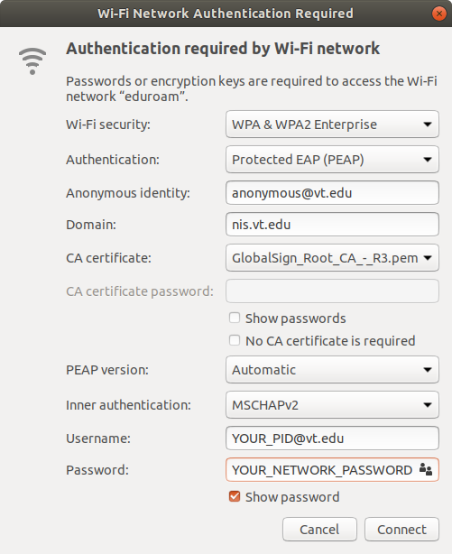

Ubuntu Notes
OS: 18.04

Essential command tools:
1. vim
2. git


My personal recommened apps:
1. Chrome, all-in-one, it got many plugins work as desktop-apps:
    * ad-blocker
    * pocket
    * evernote
    * translator
    * pdf viewer
    * google input tools (works for Chinese)
    * check plus for gmail
2. GitKraken, mostly used to trace codes
3. Anaconda
    * Spyder
    * Visual Studio Codes, with plugins
        * markdown preview
        * live server 


Some optional but useful apps:
1. Sublime, lightweight editor
2. Foxit reader, used to annote pdf
3. Dropbox, driver
4. Whatever, evernote client


# Wifi
There need some special setup to connect to ```eduroam``` wifi, take Vriginia Tech as example. Follow the [offical setup](https://vtluug.org/wiki/Virginia_Tech_Wifi) by vtluug. It is bit too long, to be breif, follow the picture below:  
  
while for CA cert.


# Anaconda

# GitKaren
